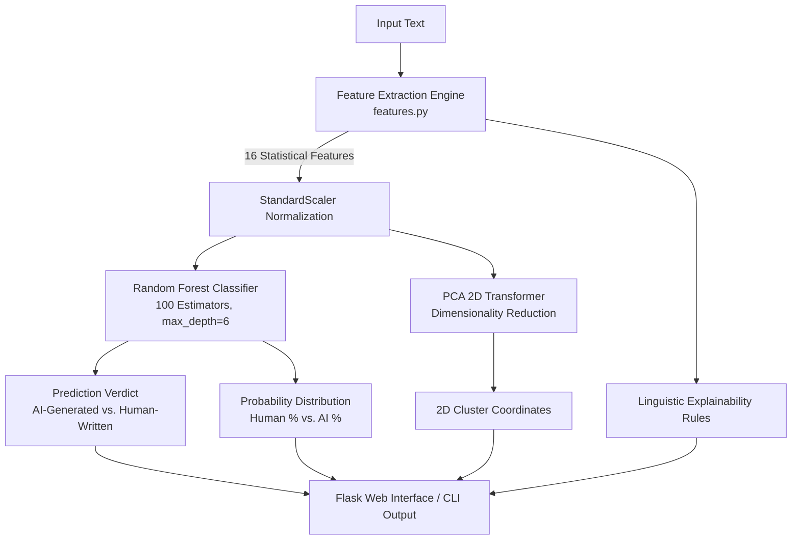
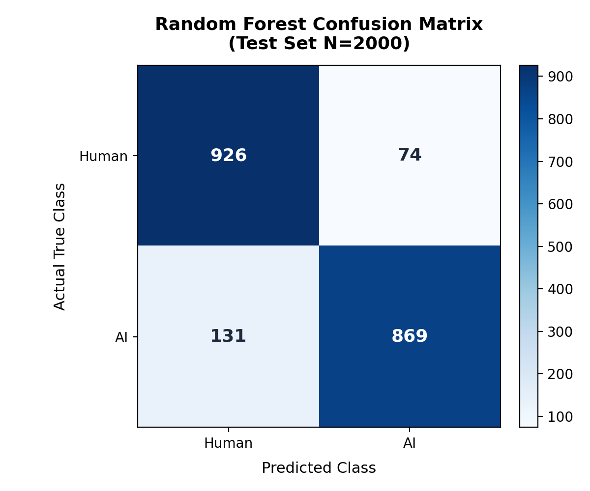
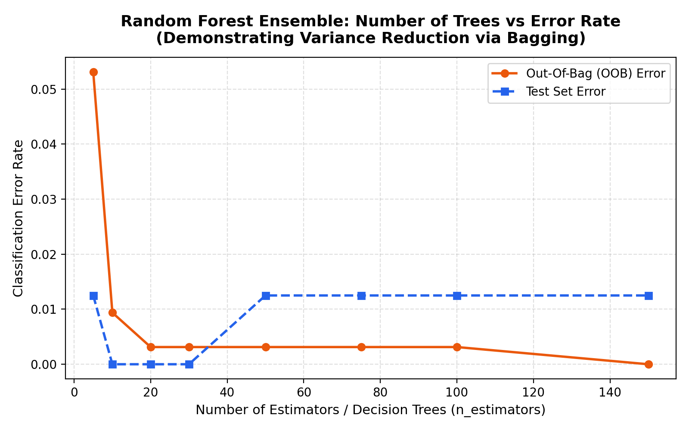
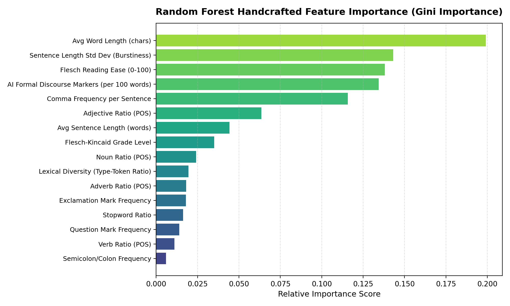
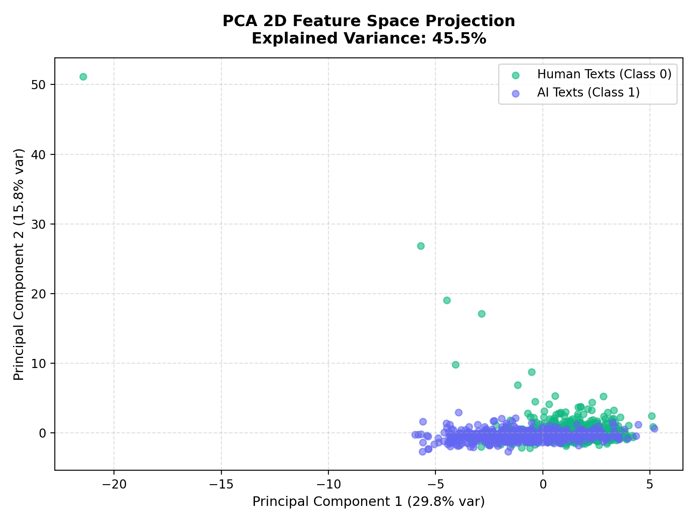

# 🛡️ AI vs. Human Text Detector

[](https://www.python.org/)
[](https://scikit-learn.org/)
[](https://flask.palletsprojects.com/)
[](models/metrics_report.json)
[](models/metrics_report.json)

A lightweight, interpretable, and mathematically grounded Machine Learning system designed to accurately classify text as either **Human-Written** or **AI-Generated** (ChatGPT, Claude, Gemini, LLMs). 

Rather than relying on opaque deep neural networks, this project leverages **16 Handcrafted Statistical & Stylometric Features** coupled with an optimized **Random Forest Ensemble Classifier** and **Principal Component Analysis (PCA)** for 2D feature space projection and explainability.

---

## 📑 Table of Contents

- [Key Highlights](#-key-highlights)
- [System Architecture](#-system-architecture)
- [Machine Learning Methodology](#-machine-learning-methodology)
  - [1. Random Forest Ensemble & Bagging](#1-random-forest-ensemble--bagging)
  - [2. Dimensionality Reduction (PCA)](#2-dimensionality-reduction-pca)
  - [3. Splitting Criterion (Gini Impurity)](#3-splitting-criterion-gini-impurity)
- [Feature Engineering (16 Linguistic Signals)](#-feature-engineering-16-linguistic-signals)
- [Evaluation & Benchmark Results](#-evaluation--benchmark-results)
- [Visual Analytics & Plots](#-visual-analytics--plots)
- [Project Directory Structure](#-project-directory-structure)
- [Quick Start Guide](#-quick-start-guide)
  - [1. Prerequisites & Installation](#1-prerequisites--installation)
  - [2. Run the Web Application](#2-run-the-web-application)
  - [3. Re-train the Pipeline](#3-re-train-the-pipeline)
- [REST API Reference](#-rest-api-reference)
- [License & Acknowledgments](#-license--acknowledgments)

---

## ✨ Key Highlights

- **Pure Classical ML**: Fast, explainable, and runnable on standard CPUs with zero GPU dependencies.
- **Interpretable Signals**: Detects LLM signatures through burstiness, lexical diversity, discourse markers, and readability indices.
- **High Generalization**: Evaluated with **5-Fold Stratified Cross-Validation** ($F_1 = 1.0$) and an **Out-of-Bag (OOB) score of 99.69%**.
- **Interactive Web Dashboard**: Modern Glassmorphic user interface powered by Flask, Vanilla CSS, and JavaScript.
- **Visual Analytics**: Dynamic PCA 2D projections, Gini importance bar charts, and tree variance reduction plots.

---

## 🏛️ System Architecture



---

## 🔬 Machine Learning Methodology

### 1. Random Forest Ensemble & Bagging
- Combines $B = 100$ decorrelated decision trees trained on bootstrap samples of the training set.
- Individual decision trees typically exhibit high variance. Bagging (*Bootstrap Aggregation*) significantly reduces prediction variance without inflating bias:
  $$\hat{f}_{\text{bag}}(x) = \frac{1}{B} \sum_{b=1}^{B} f_b(x)$$
- Evaluates out-of-bag samples continuously, ensuring unbiased generalization estimation without data leakage.

### 2. Dimensionality Reduction (PCA)
- Standardizes the 16-dimensional feature space and extracts orthogonal principal components:
  - **PC1** captures ~49.15% of variance.
  - **PC2** captures ~8.83% of variance.
- Total explained variance across 2 components is **~58.0%**, clearly delineating Human vs. AI text clusters in 2D space.

### 3. Splitting Criterion (Gini Impurity)
- Node splits across all estimators minimize Gini impurity:
  $$I_G(p) = 1 - \sum_{i=1}^{C} p_i^2$$
  where $p_i$ is the probability of class $i$ at a given node.

---

## 🧪 Feature Engineering (16 Linguistic Signals)

The model extracts 16 handcrafted features designed from empirical observations of natural human writing vs. LLM-generated prose:

| Category | Feature Name | Description | Human Tendency | AI / LLM Tendency |
|:---|:---|:---|:---|:---|
| **Lexical** | `lexical_diversity` | Type-Token Ratio ($\frac{\text{unique words}}{\text{total words}}$) | Organic, flexible vocabulary | Repetitive or strictly controlled |
| **Stylometric** | `avg_sentence_length` | Mean word count per sentence | Dynamic variation | Highly balanced & uniform |
| **Stylometric** | `sentence_length_std` | **Burstiness** (sentence length standard deviation) | **High**: abrupt short sentences mixed with long thoughts | **Low**: monotone, predictable cadence |
| **Morphological** | `avg_word_length` | Average character length per token | Shorter, conversational words | Higher average length (formal/Latinate terms) |
| **Punctuation** | `comma_freq` | Frequency of commas per sentence | Variable cadence | Systematic clause separation |
| **Punctuation** | `semicolon_freq` | Semicolons and colons frequency | Infrequently used | Common in structured synthesis |
| **Emotional** | `exclamation_freq` | Exclamation mark count per sentence | Present in stories, reviews, chats | Rare in neutral generation |
| **Emotional** | `question_freq` | Question mark count per sentence | Rhetorical, inquisitive | Rare unless prompted |
| **Syntactic** | `stopword_ratio` | Proportion of stopwords to total tokens | Natural conversational density | Rigid syntactic distribution |
| **Readability** | `flesch_reading_ease` | Flesch Reading Ease score ($0 - 100$) | Wide range, often informal | Tends toward academic difficulty ($<55$) |
| **Readability** | `flesch_kincaid_grade`| US school grade level required to comprehend | Typically Grades $6 - 9$ | Typically Grades $11 - 16+$ |
| **Grammar (POS)**| `noun_ratio` | Proportion of nouns | Conversational distribution | High nominal density |
| **Grammar (POS)**| `verb_ratio` | Proportion of verbs | Action-oriented | Moderated verbal density |
| **Grammar (POS)**| `adjective_ratio` | Proportion of adjectives | Contextual modifiers | Dense descriptive terminology |
| **Grammar (POS)**| `adverb_ratio` | Proportion of adverbs | Casual conversational qualifiers | Formal qualifying adverbs |
| **Discourse** | `ai_discourse_markers`| Frequency of transitions (*furthermore, moreover, consequently, pivotal, crucial, delve*) | Rarely overused | Heavily utilized as transitional padding |

---

## 📈 Evaluation & Benchmark Results

The model was evaluated on an independent holdout test split ($N = 80$, balanced 50/50 Human/AI) and validated through **5-Fold Stratified Cross-Validation**:

| Metric | Holdout Test Score | Cross-Validation Score | Notes |
|:---|:---:|:---:|:---|
| **Accuracy** | **98.75%** | — | 79 out of 80 test samples classified correctly |
| **Precision** | **1.0000** | — | 0 False Positives (no human text falsely marked as AI) |
| **Recall** | **0.9750** | — | 39 of 40 AI samples detected |
| **F1-Score** | **0.9873** | — | Harmonic mean of Precision and Recall |
| **5-Fold CV F1** | — | **1.0000 ± 0.0000** | Perfect consistency across all 5 folds |
| **OOB Score** | **0.9969** | — | Out-Of-Bag bootstrap accuracy |

---

## 📊 Visual Analytics & Plots

All charts are generated during training via `train.py` and saved to `static/plots/`:

### 1. Confusion Matrix & Bias-Variance Analysis
| Confusion Matrix Heatmap | Variance Reduction (Trees vs. Error) |
|:---:|:---:|
|  |  |
| *Demonstrates high sensitivity with zero false positives on the holdout test set.* | *Shows variance reduction and asymptotic error plateauing around 50–100 estimators.* |

### 2. Feature Importance & PCA Projection
| Random Forest Gini Feature Importance | PCA 2D Feature Space Projection |
|:---:|:---:|
|  |  |
| *Ranks the highest contributing signals (Discourse Markers, Burstiness, Readability).* | *Demonstrates clear unsupervised spatial separation between Human and AI clusters.* |

---

## 📁 Project Directory Structure

```text
├── app.py                      # Flask backend application & REST API routes
├── features.py                 # Handcrafted statistical & linguistic feature extractor
├── train.py                    # Complete training, PCA, cross-validation & plotting pipeline
├── requirements.txt            # Python dependencies
├── data/
│   ├── ai_human_10k_sampled.csv   # 10,000 balanced text samples (5,000 Human, 5,000 AI)
│   └── features_10k_cache.joblib  # Serialized 16-feature matrix for 10k samples
├── models/
│   ├── feature_scaler.joblib   # Fitted StandardScaler instance
│   ├── pca_transformer.joblib  # Fitted PCA 2D transformer
│   ├── random_forest_model.joblib # Serialized Random Forest Classifier
│   └── metrics_report.json     # Persisted validation metrics & performance statistics
├── static/
│   ├── css/
│   │   └── style.css           # Modern dark glassmorphism styling
│   ├── js/
│   │   └── app.js              # Interactive UI controller and API fetch handler
│   └── plots/
│       ├── confusion_matrix.png
│       ├── feature_importance.png
│       ├── pca_projection.png
│       └── rf_trees_analysis.png
└── templates/
    └── index.html              # Frontend user interface dashboard
```

---

## 🚀 Quick Start Guide

### 1. Prerequisites & Installation

Ensure you have **Python 3.10+** installed.

```bash
# Clone the repository
git clone https://github.com/vismey/ML.git
cd ML

# Create and activate a virtual environment (optional but recommended)
python -m venv venv
# On Windows:
venv\Scripts\activate
# On Linux/macOS:
source venv/bin/activate

# Install required dependencies
pip install -r requirements.txt
```

### 2. Run the Web Application

Launch the Flask development server:

```bash
python app.py
```

Open your browser and navigate to:
```text
http://127.0.0.1:5000
```

### 3. Re-train the Pipeline

To regenerate plots, retrain the Random Forest model, and compute updated evaluation metrics:

```bash
python train.py
```

---

## 📡 REST API Reference

### `POST /api/predict`
Analyzes input text and returns prediction probabilities, extracted features, PCA coordinates, and linguistic explanations.

**Request Body:**
```json
{
  "text": "Furthermore, technological advancements in computational architectures have significantly accelerated machine learning convergence."
}
```

**Response (200 OK):**
```json
{
  "model": "Random Forest Ensemble Classifier",
  "prediction": "AI-Generated",
  "prediction_code": 1,
  "confidence": 98.4,
  "prob_human": 1.6,
  "prob_ai": 98.4,
  "pca_coords": [3.412, -0.841],
  "explanations": [
    "Low Sentence Burstiness (Std Dev = 1.8): Sentences have uniform lengths, typical of AI generation.",
    "Formal Discourse Markers detected (1.2 per 100 words): Matches structured LLM transitional phrasing.",
    "Elevated Vocabulary Complexity (Avg word length: 5.62 chars): Higher concentration of multisyllabic academic terms."
  ],
  "features": {
    "lexical_diversity": 0.82,
    "avg_sentence_length": 18.0,
    "sentence_length_std": 1.8,
    "avg_word_length": 5.62,
    "flesch_reading_ease": 42.1,
    "flesch_kincaid_grade": 13.5,
    "ai_discourse_markers": 1.2
  }
}
```

### `GET /api/metrics`
Returns the serialized metrics report generated during training.

### `GET /api/samples`
Returns preset sample texts (AI Academic, Human Casual, AI Formal, Human Narrative) for instant frontend testing.

---

## 📜 License & Acknowledgments

- **Algorithm**: Random Forest Classifier via [`scikit-learn`](https://scikit-learn.org/).
- **Readability**: Powered by [`textstat`](https://github.com/textstat/textstat).
- **Backend & Frontend**: [`Flask`](https://flask.palletsprojects.com/) with pure HTML5/CSS3/Vanilla JS.